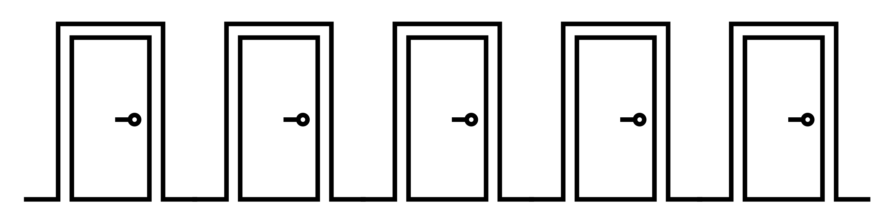

# Room Puzzle with Prolog

This project focuses on using Prolog to model a logic puzzle involving five students with different attributes (door color, subject, drink, pet, and name) living in adjacent rooms.

    

**Rules**:   
- Five students live next to each other in a student dormitory. Each door has a different colour, they all study different subjects, drink five different drinks and each has a different pet.
1. Max lives in the room with the red door.
2. Bert likes to drink tea.
3. Ute has a cat.
4. The green door is (directly) to the left of the white door.
5. Coffee is drunk in the room with the green door.
6. The student studying EIT has a budgie.
7. The resident in the room with the yellow door is studying mechanical engineering.
8. The resident in the middle house drinks milk.
9. The person studying AI lives next door to the person with the dog.
10. The person with the parrot lives next door to the person studying mechanical
engineering.
11. Monika lives in the first room if you number them from the left.
12. The computer science student drinks orange juice.
13. Rudolf is studying business administration.
14. Monika lives next to the room with the blue door.
15. Person studying AI has a neighbour who drinks water.

**Question**: Which student has a pet hamster?

---

Prolog compiler: https://swish.swi-prolog.org

---

The logic puzzle was modeled in Prolog based on the example provided by SWISH: Houses Puzzle.   
Available at: https://swish.swi-prolog.org/example/houses_puzzle.pl